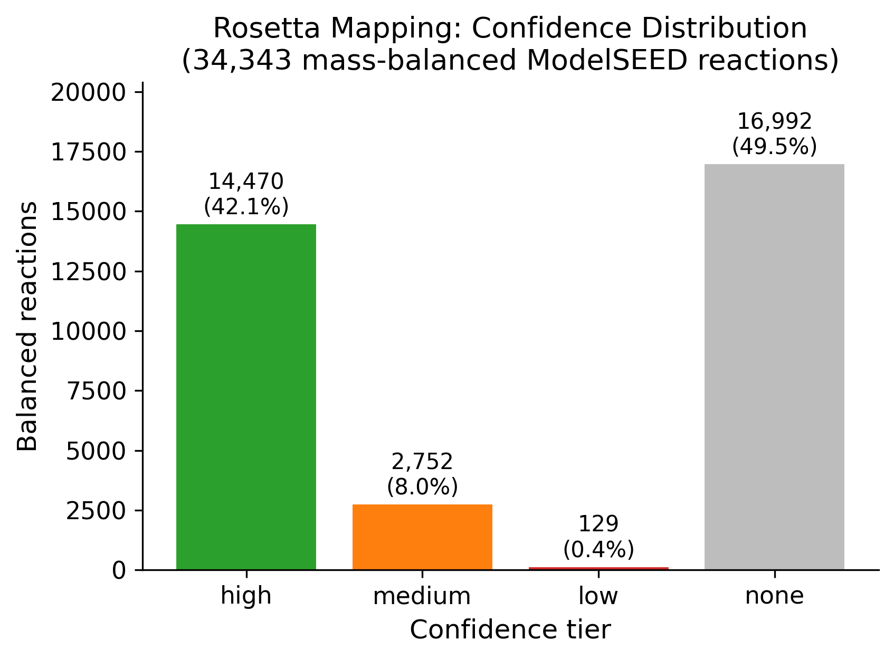
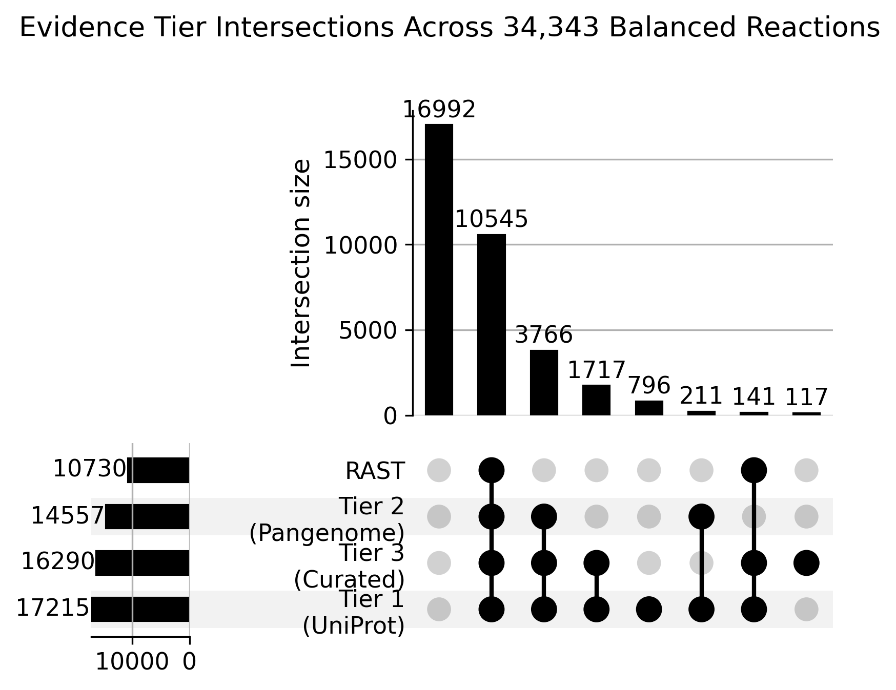
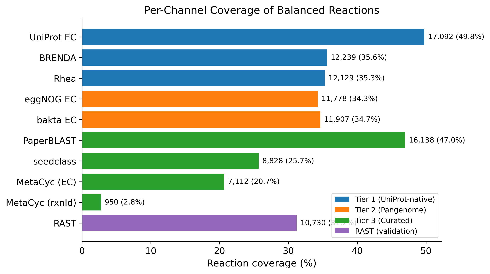
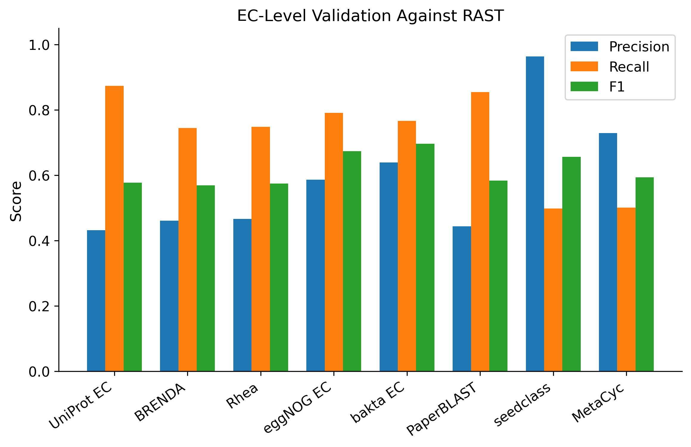
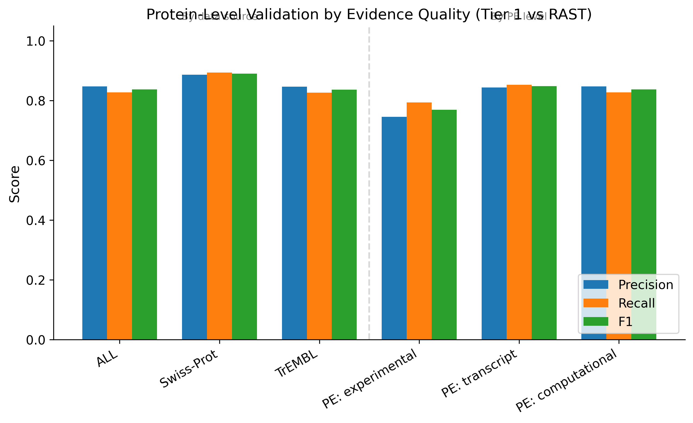
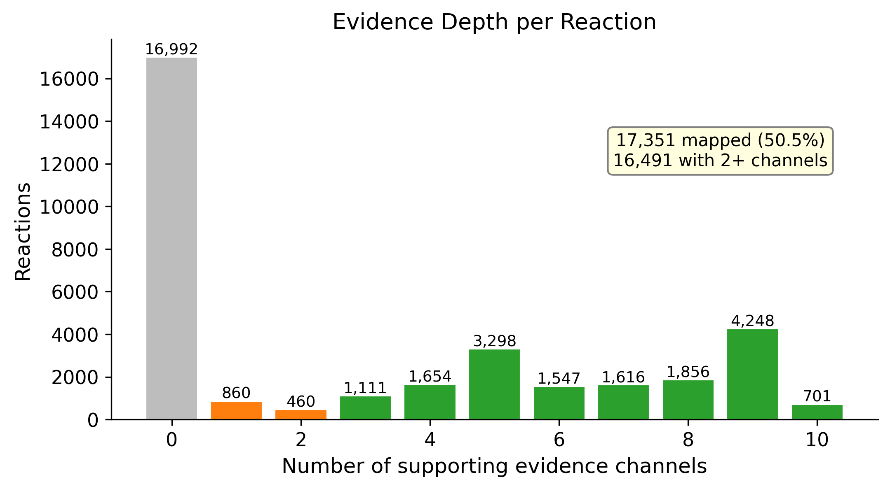

# Report: Rosetta — UniProt-to-ModelSEED Reaction Mapping

## Key Findings

### Finding 1: Multi-evidence mapping covers half of mass-balanced reactions with high accuracy

Combining 10 evidence channels across 3 tiers maps **17,351 of 34,343** mass-balanced ModelSEED reactions (50.5%). Of the mapped reactions, 14,470 (42.1% of all balanced) are **high confidence** (supported by 3+ tiers), 2,752 (8.0%) are medium confidence (2 tiers), and only 129 (0.4%) rely on a single tier. Nearly half (49.5%) of balanced reactions have no evidence from any channel, identifying them as the unmapped frontier for future annotation efforts.

*(Notebook: 06_evidence_integration.ipynb, 08_summary_visualizations.ipynb)*

### Finding 2: Tier 1 (UniProt-native) dominates; additional tiers confirm rather than expand

Tier 1 alone covers 17,215 reactions (50.1%), while Tier 2 (pangenome) adds only 18 new reactions and Tier 3 (curated/specialized) adds 117. The primary value of additional tiers is **confirmation**: 10,545 reactions (30.7%) are supported by all 4 evidence sources (Tiers 1-3 plus RAST), and 4,248 reactions have evidence from 9 of 10 channels. This deep multi-evidence support strengthens confidence even though it does not expand coverage.

*(Notebook: 06_evidence_integration.ipynb)*

### Finding 3: Protein-level validation shows strong accuracy (F1 = 0.84)

Validating Tier 1 protein-EC assignments against RAST annotations on 15.95 million shared proteins yields:
- **Precision**: 0.847 — 84.7% of Tier 1 assignments agree with RAST
- **Recall**: 0.827 — 82.7% of RAST assignments are recovered by Tier 1
- **F1**: 0.837

UniProt EC dominates this result (F1 = 0.837 on 16.7M pairs). BRENDA and Rhea have high precision (77% and 92%) but negligible recall against the full RAST set because they annotate far fewer proteins.

*(Notebook: 07_rast_validation.ipynb)*

### Finding 4: Coverage, not accuracy, is the bottleneck

The hypothesis test rejected H0 (coverage >50% and F1 >0.7) but did not support H1 (coverage >70% and F1 >0.8). The F1 threshold was exceeded (0.84 > 0.8), but coverage fell short (50.4% vs. 70%). The 16,992 unmapped reactions represent the coverage gap. This is not a failure of the mapping methodology but rather reflects the current state of enzyme annotation — roughly half of the ModelSEED biochemistry has no EC-based path from any protein annotation source.

*(Notebook: 07_rast_validation.ipynb)*

### Finding 5: Error patterns reveal annotation specificity issues

False positive analysis reveals that the top disagreements between Tier 1 and RAST involve **partial EC numbers** (e.g., 7.1.1.2, 5.4.99.-, 2.6.1.-). These represent cases where UniProt assigns a precise EC but RAST uses a broader category, or vice versa. False negatives are dominated by large enzyme families: NADH dehydrogenase (EC 1.6.5.3, 176K proteins), ABC transporters (EC 3.6.3.14, 102K proteins), and glutamine synthetases (EC 6.3.5.6, 67K proteins) — reactions that RAST annotates but UniProt may not assign the same EC.

*(Notebook: 07_rast_validation.ipynb)*

### Finding 6: Swiss-Prot annotations are more accurate, but computationally inferred proteins dominate coverage

Stratifying Tier 1 validation by UniProt evidence quality reveals two dimensions:

**Data source**: Swiss-Prot (reviewed, manually curated) annotations achieve F1 = 0.890 vs TrEMBL (unreviewed) F1 = 0.837 — a +5.3 percentage point advantage. Swiss-Prot has both higher precision (88.6% vs 84.7%) and higher recall (89.4% vs 82.7%), confirming that manual curation improves annotation quality. However, Swiss-Prot proteins represent only 0.8% of Tier 1 (218K of 26.5M unique proteins) and reach 44.2% of balanced reactions. TrEMBL contributes 523 exclusive ECs that map to 2,043 additional reactions — modest but non-trivial.

**Protein existence (PE) level**: Counterintuitively, experimentally characterized proteins (PE1) have the *lowest* F1 (0.769), below transcript-level (0.848) and computationally inferred (0.837). This likely reflects two factors: (1) experimentally studied proteins are often multi-functional enzymes where UniProt assigns precise ECs that differ from RAST's broader functional roles, and (2) the PE-experimental set mixes 36K high-quality Swiss-Prot entries with 43K TrEMBL entries that inherit the "experimental" PE level through orthology transfer without the same curation depth.

| Stratum | Proteins | Precision | Recall | F1 |
|---------|----------|-----------|--------|-----|
| ALL | 15,952,112 | 84.7% | 82.7% | 0.837 |
| Swiss-Prot | 159,546 | 88.6% | 89.4% | 0.890 |
| TrEMBL | 15,792,566 | 84.7% | 82.7% | 0.837 |
| PE: experimental | 29,410 | 74.6% | 79.4% | 0.769 |
| PE: transcript | 83,881 | 84.4% | 85.2% | 0.848 |
| PE: computational | 15,838,777 | 84.7% | 82.7% | 0.837 |

*(Notebook: 09_evidence_stratified_validation.ipynb)*

## Results

### Evidence Channel Coverage

| Channel | Tier | Reactions | Coverage |
|---------|------|-----------|----------|
| UniProt EC | 1 | 17,092 | 49.8% |
| PaperBLAST | 3 | 16,138 | 47.0% |
| BRENDA | 1 | 12,239 | 35.6% |
| Rhea | 1 | 12,129 | 35.3% |
| bakta EC | 2 | 11,907 | 34.7% |
| eggNOG EC | 2 | 11,778 | 34.3% |
| RAST | val | 10,730 | 31.2% |
| seedclass | 3 | 8,828 | 25.7% |
| MetaCyc (EC) | 3 | 7,112 | 20.7% |
| MetaCyc (rxnId) | 3 | 950 | 2.8% |
| **Combined** | **all** | **17,351** | **50.5%** |

### Evidence Depth

| Channels | Reactions | % of Total |
|----------|-----------|------------|
| 0 | 16,992 | 49.5% |
| 1-2 | 1,320 | 3.8% |
| 3-5 | 6,063 | 17.7% |
| 6-8 | 5,019 | 14.6% |
| 9-10 | 4,949 | 14.4% |

### Bridge Table Statistics

| Bridge | Mappings | Unique Keys |
|--------|----------|-------------|
| EC → reaction | 22,823 | 6,100 ECs |
| KEGG R-number → reaction | 6,851 | 6,354 R-numbers |
| MetaCyc → reaction | 5,039 | 4,480 MetaCyc IDs |

### EC Coverage Across Tiers

- Tier 1: 5,032 unique ECs
- Tier 2: 3,783 unique ECs
- Tier 3: 4,780 unique ECs
- RAST: 2,439 unique ECs
- Combined: 5,428 unique ECs (of 6,100 in bridge = 84.0%)

EC overlap is high: 3,683 ECs are shared by all three tiers. Tier 1 contributes 247 exclusive ECs; Tier 3 contributes 78; Tier 2 only 9.

## Interpretation

### Biological Significance

The Rosetta mapping demonstrates that **systematic multi-evidence integration can reliably link approximately half of the known mass-balanced biochemistry to protein annotations**, with high confidence. The 14,470 high-confidence mappings (42.1% of balanced reactions) provide a robust foundation for automated metabolic model reconstruction. These reactions are supported by 3-4 independent evidence tiers, making them highly reliable for gap-filling and model comparison.

The 50% coverage ceiling is inherent to the current state of enzyme characterization rather than a limitation of the mapping approach. The unmapped 16,992 reactions likely include: (1) reactions with no known enzyme (orphan reactions), (2) reactions with known enzymes that lack EC assignments, and (3) reactions in specialized or poorly studied metabolic pathways.

### Literature Context

The ModelSEED biochemistry database was designed as a "Rosetta Stone" for reconciling annotations across tools and databases (Seaver et al., 2021). This project operationalizes that vision at scale, systematically evaluating which evidence channels actually contribute to protein-reaction mapping and quantifying their reliability.

Automated reconstruction tools — ModelSEED/KBase, CarveMe (Machado et al., 2018), and gapseq (Zimmermann et al., 2021) — each rely on different annotation pipelines and biochemical databases. Hsieh et al. (2024) showed that models reconstructed from different tools (CarveMe, gapseq, KBase) produce varying numbers of reactions and functional predictions due to database differences. The Rosetta mapping addresses this fragmentation by aggregating all evidence channels into a unified, scored mapping that tools can draw from.

PaperBLAST (Price & Arkin, 2024) contributes surprisingly strong reaction coverage (47.0%) despite its relatively small protein set (74.9K entities), because its curated annotations span a wide EC space (4,700 ECs). This aligns with its design as a tool for finding experimentally characterized homologs.

ModelSEEDv2 (Faria et al., 2023) identified "poorly mapped annotations" as a major cause of model reconstruction errors. The Rosetta mapping quantifies this: 2,900 ECs present in Tier 1 are absent from RAST, and 307 RAST ECs are absent from Tier 1 — these discrepancies propagate through any tool that relies on a single annotation source.

### Novel Contribution

1. **First systematic quantification of multi-evidence reaction coverage**: No prior work has combined UniProt, eggNOG, bakta, PaperBLAST, FitnessBrowser, and RAST annotations against the full ModelSEED balanced-reaction set and measured coverage and accuracy.

2. **Evidence that additional tiers confirm rather than expand**: The finding that Tier 2 adds only 18 new reactions beyond Tier 1 was unexpected — it means pangenome-scale annotation (93.6M eggNOG rows) provides redundant rather than complementary evidence at the reaction level.

3. **Identification of the 50% coverage ceiling**: The unmapped 16,992 reactions represent a concrete target for future enzyme discovery and annotation efforts. These reactions are invisible to all current annotation tools.

4. **Validated EC→reaction bridge tables**: The parquet bridge files (EC, KEGG, MetaCyc → balanced ModelSEED reactions) are reusable data products for any downstream metabolic modeling pipeline.

### Limitations

1. **Protein-level validation is limited to Tier 1 vs RAST**: Tier 2 uses gene cluster IDs and Tier 3 uses locus IDs, so cross-entity protein-level F1 cannot be computed for those tiers. EC-level validation is the only common metric across all tiers.

2. **EC number granularity**: Many-to-many EC→reaction mappings inflate apparent coverage. A protein annotated with EC 2.7.1.1 maps to multiple reactions, not all of which it catalyzes. Conversely, partial ECs (e.g., 2.6.1.-) produce false positives when matched against specific reactions.

3. **RAST as ground truth**: RAST annotations are themselves automated predictions, not experimentally verified. The F1 score measures agreement between two automated systems, not absolute accuracy. However, RAST is the annotation pipeline used by ModelSEED for model reconstruction, making it a pragmatically valid benchmark.

4. **No direct Rhea→reaction bridge**: Rhea IDs were mapped through co-annotated EC numbers rather than a direct Rhea-to-ModelSEED bridge. The 33.8K proteins with Rhea but no EC represent a small missed opportunity.

5. **Coverage is EC-centric**: Evidence channels that could bypass EC (e.g., sequence similarity, structural homology, substrate docking) were not included. These approaches could potentially reach reactions in the unmapped 49.5%.

## Data

### Sources

| Collection | Tables Used | Purpose |
|------------|-------------|---------|
| `kbase_msd_biochemistry` | `reaction`, `molecule`, `reagent` | Target reaction set (34,343 balanced) |
| `refdata_uniprot` | `identifier`, `entity`, `protein`, `name`, `comment_xml` | UniProt cross-references and Rhea catalytic activity |
| `kbase_ke_pangenome` | `eggnog_mapper_annotations`, `bakta_annotations`, `bakta_db_xrefs` | Pangenome-level EC and KEGG annotations |
| `kescience_fitnessbrowser` | `curatedgene`, `seedclass`, `besthitmetacyc` | Curated gene functions, EC assignments, MetaCyc links |
| `refdata_interpro` | `protein2ipr`, `go_mapping` | InterPro domain→GO→EC chain (explored, not in final mapping) |
| `u_seaver__msd_biochemistry` | `reaction`, `molecule`, `reagent` | User-augmented biochemistry (same schema) |

### Generated Data

| File | Rows | Description |
|------|------|-------------|
| `data/ec_to_reaction.parquet` | 22,823 | EC→balanced ModelSEED reaction bridge |
| `data/kegg_to_reaction.parquet` | 6,851 | KEGG R-number→balanced reaction bridge |
| `data/metacyc_to_reaction.parquet` | 5,039 | MetaCyc→balanced reaction bridge |
| `data/rast_protein_ec.parquet` | 32,420,974 | RAST protein→EC validation set |
| `data/uniprot_native_protein_ec.parquet` | 27,639,185 | Tier 1 protein→EC mappings |
| `data/pangenome_gc_ec.parquet` | 30,180,448 | Tier 2 gene cluster→EC mappings |
| `data/curated_evidence_ec.parquet` | 150,658 | Tier 3 curated entity→EC mappings |
| `data/besthitmetacyc_rxnid.parquet` | 22,310 | MetaCyc direct reaction ID mappings |
| `data/evidence_integration_summary.parquet` | 34,343 | Final per-reaction evidence matrix |
| `data/swissprot_proteins.parquet` | 574,627 | Swiss-Prot protein IDs for evidence stratification |

## Supporting Evidence

### Notebooks

| Notebook | Purpose |
|----------|---------|
| `01_schema_discovery.ipynb` | Characterize table schemas, enumerate cross-reference types |
| `02_bridge_tables.ipynb` | Build EC/KEGG/MetaCyc→reaction bridges; process RAST annotations |
| `03_uniprot_native_evidence.ipynb` | Tier 1: UniProt EC, BRENDA, Rhea evidence extraction |
| `04_pangenome_evidence.ipynb` | Tier 2: eggNOG and bakta EC/KEGG annotation collection |
| `05_curated_specialized_evidence.ipynb` | Tier 3: PaperBLAST, seedclass, besthitmetacyc evidence |
| `06_evidence_integration.ipynb` | Combine all channels, assign confidence tiers |
| `07_rast_validation.ipynb` | Validate against RAST: EC-level, protein-level, reaction-level F1 |
| `08_summary_visualizations.ipynb` | Publication-quality figures |
| `09_evidence_stratified_validation.ipynb` | Stratified validation by Swiss-Prot/TrEMBL and PE level |

### Figures

| Figure | Description |
|--------|-------------|
| `confidence_distribution.png` | Bar chart of high/medium/low/none confidence tiers |
| `tier_upset.png` | UpSet plot of Tier 1/2/3/RAST intersections |
| `channel_coverage.png` | Horizontal bar chart of per-channel reaction coverage |
| `ec_validation_f1.png` | Grouped bar chart of precision/recall/F1 per channel vs RAST |
| `evidence_depth.png` | Histogram of reactions by number of supporting channels |
| `evidence_stratified_f1.png` | Grouped bar chart of precision/recall/F1 by evidence quality stratum |

## Future Directions

1. **Bridge the Rhea gap**: Build a direct Rhea→ModelSEED reaction mapping using substrate/product ChEBI IDs from `comment_xml`, bypassing EC. This could recover the 33.8K Rhea-only proteins.

2. **Sequence-based mapping**: Use protein sequence similarity (e.g., BLAST against experimentally characterized enzymes) to reach reactions in the unmapped 49.5% that have no EC-based path.

3. **Characterize unmapped reactions**: Analyze the 16,992 unmapped reactions for pathway membership, organism distribution, and overlap with known orphan enzyme lists to prioritize experimental characterization.

4. **Deploy as ModelSEED reconstruction input**: Integrate the scored mapping table as an additional annotation source in ModelSEEDv2 to evaluate whether multi-evidence confidence scoring reduces gap-filling requirements.

5. **Cross-species validation**: Use pangenome gene cluster annotations (Tier 2) to assess whether the mapping transfers correctly across species within a pangenome.

## References

- Seaver SMD, Liu F, Zhang Q, et al. (2021). "The ModelSEED Biochemistry Database for the integration of metabolic annotations and the reconstruction, comparison and analysis of metabolic models for plants, fungi and microbes." *Nucleic Acids Research*, 49(D1):D575-D588. [DOI: 10.1093/nar/gkaa746](https://doi.org/10.1093/nar/gkaa746). PMID: 32986834.

- Faria JP, Liu F, Edirisinghe JN, et al. (2023). "ModelSEEDv2: High-throughput genome-scale metabolic model reconstruction with enhanced energy biosynthesis pathway prediction." *bioRxiv*. [DOI: 10.1101/2023.10.04.556561](https://doi.org/10.1101/2023.10.04.556561).

- Machado D, Andrejev S, Tramontano M, Patil KR. (2018). "Fast automated reconstruction of genome-scale metabolic models for microbial species and communities." *Nucleic Acids Research*, 46(15):7542-7553. [DOI: 10.1093/nar/gky537](https://doi.org/10.1093/nar/gky537). PMID: 30192979.

- Zimmermann J, Kaleta C, Waschina S. (2021). "gapseq: informed prediction of bacterial metabolic pathways and reconstruction of accurate metabolic models." *Genome Biology*, 22:81. [DOI: 10.1186/s13059-021-02295-1](https://doi.org/10.1186/s13059-021-02295-1).

- Hsieh YE, Tandon K, Verbruggen H, Nikoloski Z. (2024). "Comparative analysis of metabolic models of microbial communities reconstructed from automated tools and consensus approaches." *NPJ Systems Biology and Applications*, 10(1):54. [DOI: 10.1038/s41540-024-00384-y](https://doi.org/10.1038/s41540-024-00384-y). PMID: 38783065.

- Price MN, Arkin AP. (2024). "Interactive tools for functional annotation of bacterial genomes." *Database*, 2024:baae089. [DOI: 10.1093/database/baae089](https://doi.org/10.1093/database/baae089). PMID: 39241109.

- Nursimulu N, Moses AM. (2022). "Architect: A tool for aiding the reconstruction of high-quality metabolic models through improved enzyme annotation." *PLoS Computational Biology*, 18(9):e1010452. [DOI: 10.1371/journal.pcbi.1010452](https://doi.org/10.1371/journal.pcbi.1010452).

- Price MN, Wetmore KM, Waters RJ, et al. (2018). "Mutant phenotypes for thousands of bacterial genes of unknown function." *Nature*, 557:503-509. [DOI: 10.1038/s41586-018-0124-0](https://doi.org/10.1038/s41586-018-0124-0).

- Arkin AP, Cottingham RW, Henry CS, et al. (2018). "KBase: The United States Department of Energy Systems Biology Knowledgebase." *Nature Biotechnology*, 36:566-569. [DOI: 10.1038/nbt.4163](https://doi.org/10.1038/nbt.4163).
