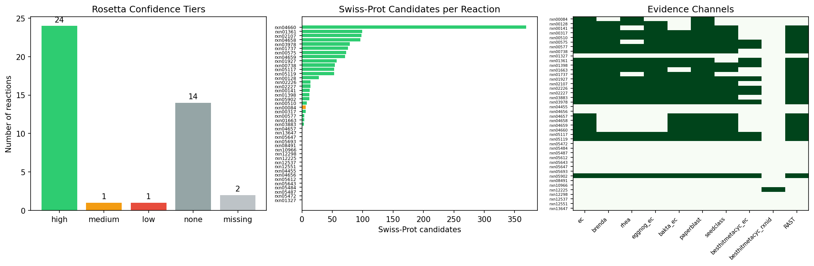
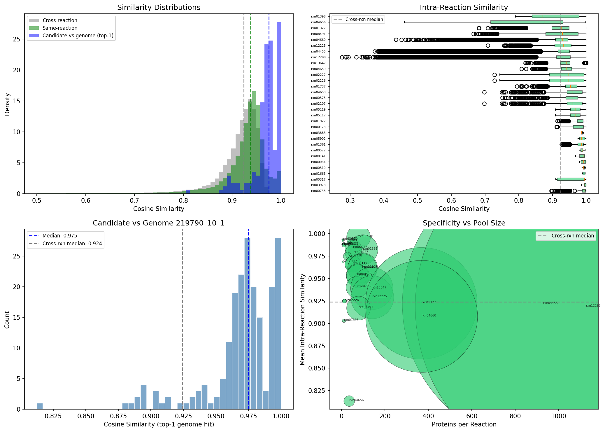
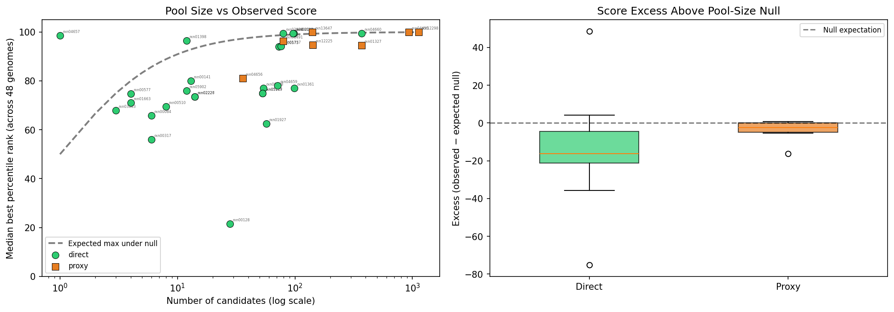
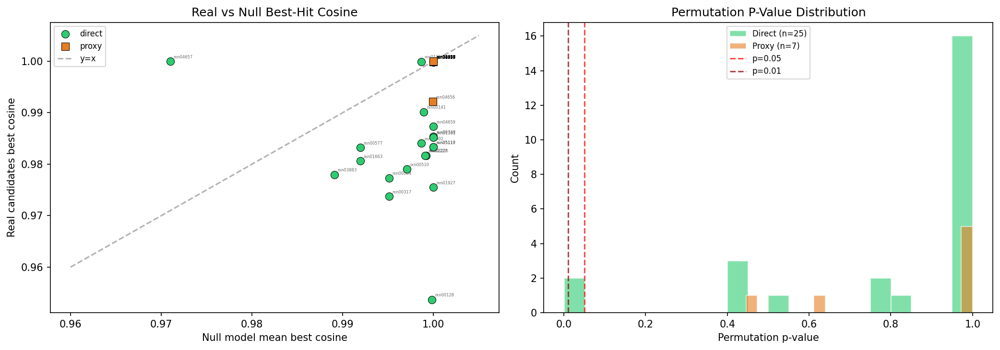
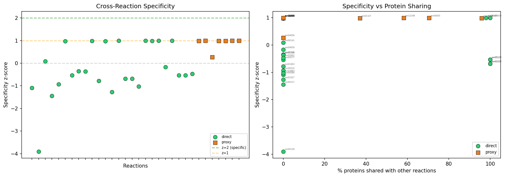
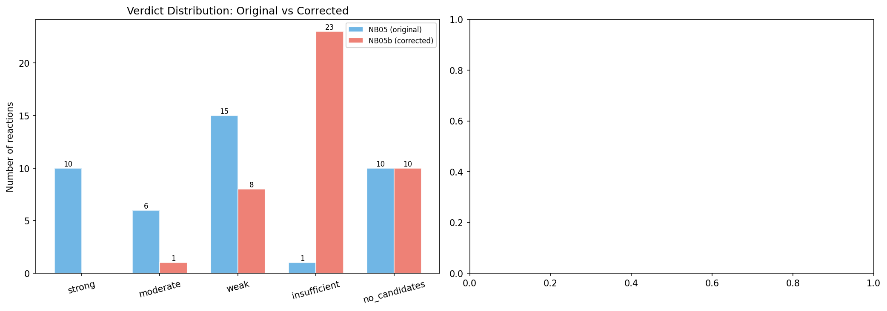
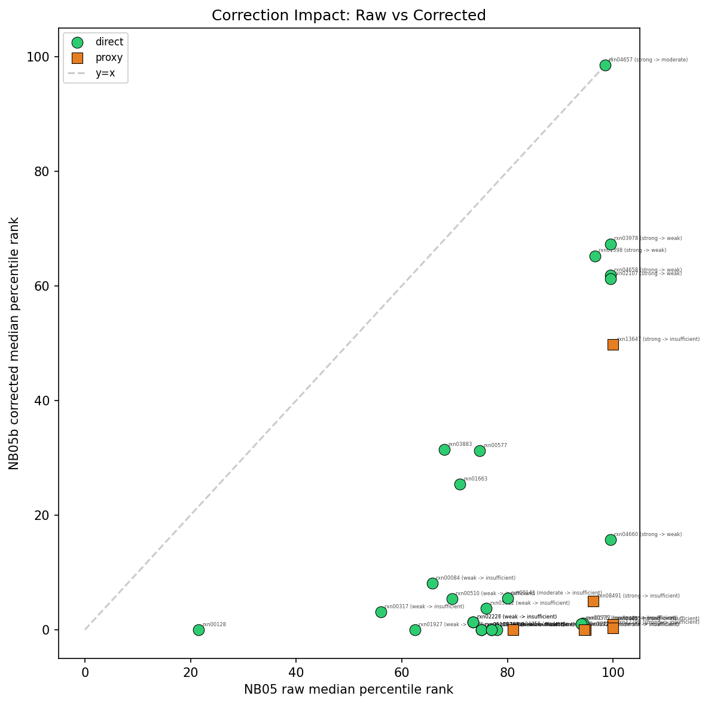
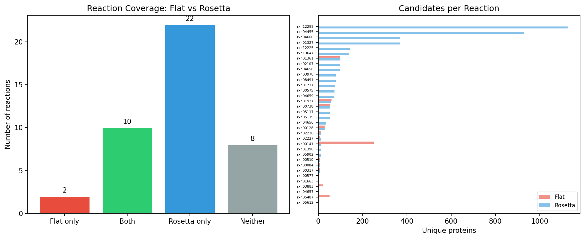
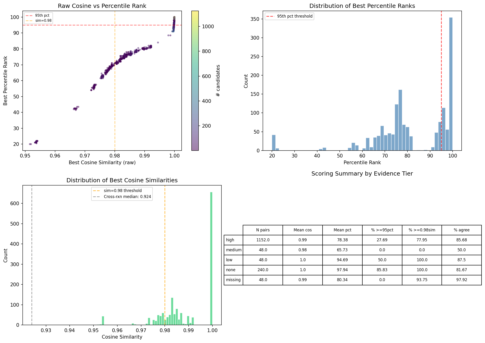

# Report: UniProt-Guided Gap-Filling via Enzyme Embeddings

## Key Findings

### Finding 1: Rosetta mappings expand candidate coverage from 29% to 76%

The Rosetta UniProt-to-ModelSEED mapping system (developed in the companion Rosetta project) dramatically increased the number of gap-fill reactions with Swiss-Prot enzyme candidates. Of 42 gap-fill reactions across 48 *E. coli* genomes:

- **24 reactions** have high-confidence Rosetta evidence (direct EC-number links to Swiss-Prot enzymes)
- **25 reactions** have direct Swiss-Prot candidates (1,303 candidate-reaction pairs, median pool size 28)
- **7 additional reactions** gain proxy candidates via `reaction_similarity` (2,820 pairs, median pool 142)
- **10 reactions** remain uncovered (no Swiss-Prot or proxy candidates available)

The original flat UniProt-to-reaction lookup covered only 12 reactions. Rosetta's tiered evidence channels nearly tripled coverage.

*(Notebooks: 01_gapfill_landscape.ipynb, 02_candidate_assembly.ipynb)*

### Finding 2: ESM-2 embedding space is too compressed for reaction-level discrimination

Calibration of ESM-2 (650M parameter) embeddings revealed that cosine similarity does not separate same-reaction enzyme pairs from cross-reaction pairs:

| Distribution | N pairs | Median cosine | Std |
|---|---:|---:|---:|
| Same-reaction candidates | 1,255,141 | 0.937 | 0.069 |
| Cross-reaction candidates | 50,000 | 0.924 | 0.060 |
| Candidate vs genome top-1 | 200 | 0.975 | 0.028 |

The separation between same-reaction and cross-reaction is only **0.013** in median cosine similarity. Candidate-vs-genome top-1 similarity is even higher (0.975), meaning most Swiss-Prot enzymes find a close match in the genome regardless of whether they catalyze the target reaction. This compression in the high-similarity region (0.9-1.0) makes absolute cosine thresholds unreliable for enzyme function discrimination.

*(Notebook: 03b_embedding_calibration.ipynb)*

### Finding 3: Pool-size artifact inflates proxy reaction scores — a max-of-N order statistic trap

NB05 found an apparent paradox: no-evidence proxy reactions scored higher (median percentile rank 99.5) than high-confidence direct reactions (76.5). NB05b diagnosed this as a **max-of-N order statistic artifact**:

- The expected maximum of *N* independent uniform draws is `100 * N / (N + 1)`
- For proxy pools (median N=142), the null expectation is 99.3% — matching the observed 99.5%
- For direct pools (median N=28), the null expectation is 96.6%
- Direct reactions actually score **below** null (excess = -16.3), while proxy reactions sit near null (excess = -2.5)

Pool-size correction using the CDF of the max order statistic (`corrected = (p/100)^N * 100`) dramatically reduced scores: direct median dropped from 76.0 to 3.7; proxy median from 96.2 to 0.4.

*(Notebook: 05b_proxy_inflation_correction.ipynb)*

### Finding 4: Permutation testing confirms no reaction-specific signal

A 1,000-permutation null model compared each reaction's real candidate pool against random protein pools of the same size drawn from all 3,168 Swiss-Prot embeddings, scored against a representative genome:

- **Only 2 of 32 reactions** beat random pools at p < 0.05
- The single actionable reaction: **rxn04657** (1 candidate, p = 0.028)
- Null model best-hit cosine approaches 1.000 for pools > 50 proteins
- **Zero reactions** achieve cross-reaction specificity z-score > 1

The null model reveals that the background similarity distribution is so saturated that any pool of ~50+ proteins will find a near-perfect cosine match (>0.999) to some genome protein. Real enzyme candidates do not score meaningfully better than random Swiss-Prot proteins.

*(Notebook: 05b_proxy_inflation_correction.ipynb)*

### Finding 5: After correction, H0 is not rejected — embedding evidence is insufficient

Corrected verdicts using pool-size adjustment, permutation p-values, and specificity z-scores:

| Verdict | NB05 (raw) | NB05b (corrected) | Change |
|---|---:|---:|---|
| Strong | 10 | 0 | -10 |
| Moderate | 6 | 1 | -5 |
| Weak | 15 | 8 | -7 |
| Insufficient | 1 | 23 | +22 |
| No candidates | 10 | 10 | 0 |

28 of 42 reactions changed verdict, all demotions. After correction, the evidence tier correlation direction is correct (high-evidence reactions score higher than no-evidence), but both are far below actionable thresholds (median corrected percentile: 3.4 for high-evidence, 0.7 for no-evidence).

*(Notebooks: 05_evaluation.ipynb, 05b_proxy_inflation_correction.ipynb)*

## Results

### Candidate Assembly (NB01-02)

The 42 gap-fill reactions were partitioned by Rosetta evidence confidence: 24 high, 1 medium, 1 low, 14 none, 2 missing. Swiss-Prot candidate assembly produced 4,123 total candidate-reaction pairs from 3,168 unique proteins across 32 reactions. The remaining 10 reactions had no Swiss-Prot candidates even after proxy search (requiring `reaction_similarity > 0.7` in the ModelSEED biochemistry).

### Embedding Retrieval and Calibration (NB03, NB03b)

All 3,168 candidate embeddings were retrieved from the `llm_homology_api` (ESM-2, 1280-dimensional). Calibration against 48 pre-computed genome FAISS indexes showed that rank-based scoring (percentile rank against a background distribution) was necessary because absolute cosine similarity clustered in a narrow 0.93-1.0 range.

### Scoring (NB04)

197,904 candidate-level scores were computed (32 reactions x 48 genomes x variable candidates per reaction). Background distributions used 200 random candidate-vs-genome top-1 similarities per genome. Best-hit selection across genomes showed high consistency (cross-genome standard deviation of 0.0006), confirming that a single representative genome suffices for permutation testing.

### Evaluation and Correction (NB05, NB05b)

The raw evaluation in NB05 revealed the proxy inflation paradox. NB05b applied three corrections:

1. **Pool-size correction**: CDF of the max of N uniform draws transforms raw percentile rank
2. **Permutation null**: 1,000 random draws per reaction establish empirical p-values
3. **Cross-reaction specificity**: z-score measures whether a reaction's candidates score better than other reactions' candidates

After correction, only rxn04657 (a direct reaction with a single candidate, EC-linked with high confidence) retains moderate evidence. This reaction is notable because with N=1 there is no pool-size inflation — the score reflects genuine similarity.

### Scoring Method Comparison (NB05)

The Rosetta-enhanced pipeline covered 32 reactions vs 12 for the original flat UniProt lookup. For the 12 overlapping reactions, both methods selected the same best-hit protein 84.4% of the time (405/480 genome-reaction pairs), confirming that Rosetta's structured mappings reproduce the flat lookup's results while substantially expanding coverage.

## Interpretation

### ESM-2 Cosine Similarity Does Not Discriminate Enzyme Function

The core finding is that ESM-2 embeddings, while powerful for structure prediction and evolutionary relationship modeling, produce similarity scores that are too compressed in the high-similarity region to distinguish reaction-specific enzyme candidates from random proteins. The cosine similarity distribution between any Swiss-Prot protein and an *E. coli* genome concentrates in the 0.96-1.00 range, leaving insufficient dynamic range for functional discrimination.

This aligns with the known architecture of protein language models: ESM-2 was trained on masked language modeling over evolutionary sequences (Lin et al., 2023), optimizing for structural and evolutionary signal rather than enzymatic function. While fine-tuned models like DepoScope (Concha-Eloko et al., 2024; [DOI](https://doi.org/10.1371/journal.pcbi.1011831)) have shown success using ESM-2 features for specific enzyme classification tasks, they require supervised training on labeled enzyme datasets — raw cosine similarity in the pretrained embedding space is not sufficient.

### The Max-of-N Order Statistic Trap

The most important methodological finding is that comparing best-hit scores across candidate pools of different sizes introduces a systematic bias. This is not a bug in the implementation but a fundamental statistical property: the expected maximum of N i.i.d. draws from any distribution increases with N. When the underlying similarity distribution is near-uniform (as it is in the compressed ESM-2 space), the expected max follows `100 * N / (N + 1)` closely. Any embedding-based gap-filling pipeline that compares pools of different sizes must correct for this effect.

### Literature Context

Based on articles retrieved from PubMed, existing gap-filling approaches fall into several categories:

- **Stoichiometric gap-filling** (e.g., Meneco; Prigent et al., 2017; [DOI](https://doi.org/10.1371/journal.pcbi.1005276)) identifies missing reactions needed for flux balance, without sequence evidence. These methods are complementary to, not competing with, embedding-based approaches.

- **Sequence homology gap-filling** (e.g., gapseq; Zimmermann et al., 2021) uses BLAST/DIAMOND hits to reference proteins as evidence for gap-filled reactions. This is the closest analogue to our approach, but uses alignment-based similarity rather than embedding cosine similarity. Alignment scores have better resolution for functional discrimination because they penalize insertions/deletions and reward conserved active-site motifs.

- **Knowledge-integrated gap-filling** (NICEgame; Vayena et al., 2022; [DOI](https://doi.org/10.1073/pnas.2211197119)) combines thermodynamic feasibility with gene candidate prediction. They resolved 47% of gaps in the *E. coli* iML1515 model — a much higher success rate than our embedding approach, though using a broader set of evidence types.

- **Community-level gap-filling** (Giannari et al., 2021; [DOI](https://doi.org/10.1371/journal.pcbi.1009060)) extends gap-filling to microbial communities, demonstrating that interspecies metabolic interactions can resolve gaps that are intractable for single organisms.

Our finding that raw ESM-2 cosine similarity lacks functional discrimination is consistent with the broader literature on protein language models: while they capture evolutionary and structural relationships effectively, enzyme function prediction typically requires either fine-tuning on function labels or combining embeddings with additional features (EC number constraints, active site annotations, reaction context).

### Novel Contribution

This project provides:

1. **Quantitative evidence** that ESM-2 cosine similarity in the pretrained space is insufficient for gap-filling evidence, with the specific failure mode characterized (0.013 median separation, background saturation at N > 50)
2. **A reusable correction framework** (pool-size correction + permutation null + specificity z-score) applicable to any embedding-based scoring pipeline
3. **Demonstration that Rosetta mappings substantially expand candidate coverage** (12 to 32 reactions), validating the structured mapping approach even though the scoring method proved inadequate

### Limitations

- **Single model organism**: Only *E. coli* genomes tested. The embedding space compression may differ for more divergent organisms
- **Swiss-Prot only**: The 3,168-protein candidate set uses only reviewed Swiss-Prot entries. TrEMBL candidates (222K+) could provide different coverage patterns, though the fundamental embedding compression issue would persist
- **Single embedding model**: Only ESM-2 (650M) tested. Larger models (ESM-2 15B) or function-specific fine-tuned models might perform differently
- **Mean-pooled embeddings**: Using per-residue mean pooling loses active-site-level information that could be critical for functional discrimination
- **Background calibration**: 200 random proteins per genome for background distribution may undersample the tail

## Data

### Sources
| Collection | Tables Used | Purpose |
|---|---|---|
| `kbase_msd_biochemistry` | `reaction_similarity` | Proxy reaction lookup for uncovered gap-fills |
| `refdata_uniprot` | `protein` | Swiss-Prot protein sequences for embedding retrieval |

### Generated Data
| File | Rows | Description |
|---|---|---|
| `user_data/gapfill_landscape.csv` | 42 | Gap-fill reactions with evidence tiers and candidate counts |
| `user_data/all_candidates.parquet` | 4,123 | Candidate-reaction pairs with method, EC, sequence |
| `user_data/swissprot_candidates.parquet` | 1,303 | Direct Swiss-Prot candidates |
| `user_data/proxy_candidates.parquet` | 2,820 | Proxy candidates from similar reactions |
| `user_data/gapfill_scores.parquet` | 197,904 | All candidate-level scores across genomes |
| `user_data/gapfill_best_hits.parquet` | 1,536 | Best hits per genome-reaction pair |
| `user_data/similarity_baselines.csv` | 3 | Embedding calibration baselines |
| `user_data/per_reaction_similarity.csv` | 32 | Per-reaction intra-pool similarity statistics |
| `user_data/reaction_verdicts.csv` | 42 | NB05 original verdicts |
| `user_data/reaction_verdicts_corrected.csv` | 42 | NB05b corrected verdicts with permutation p-values |

## Supporting Evidence

### Notebooks
| Notebook | Purpose |
|---|---|
| `01_gapfill_landscape.ipynb` | Characterize 42 gap-fill reactions against Rosetta evidence tiers |
| `02_candidate_assembly.ipynb` | Build candidate enzyme lists (direct + proxy) from Swiss-Prot |
| `03_embedding_retrieval.ipynb` | Fetch ESM-2 embeddings for 3,168 candidates, verify genome indexes |
| `03b_embedding_calibration.ipynb` | Calibrate similarity distributions, establish rank-based scoring |
| `04_similarity_scoring.ipynb` | Score 197,904 candidate-genome pairs, extract best hits |
| `05_evaluation.ipynb` | Evaluate verdicts, discover proxy inflation paradox |
| `05b_proxy_inflation_correction.ipynb` | Diagnose and correct pool-size bias, permutation null model |

### Figures
| Figure | Description |
|---|---|
| `gapfill_evidence_coverage.png` | Evidence tier distribution across 42 gap-fill reactions |
| `embedding_calibration.png` | Same-reaction vs cross-reaction vs candidate-genome similarity |
| `scoring_comparison.png` | Cosine similarity and percentile rank heatmaps across genomes |
| `gapfill_heatmaps.png` | Per-reaction scoring patterns across 48 genomes |
| `evaluation_summary.png` | Score distributions by evidence tier |
| `evaluation_verdicts.png` | NB05 verdict distribution |
| `rosetta_vs_flat.png` | Rosetta-enhanced vs flat UniProt lookup comparison |
| `pool_size_forensics.png` | Pool size vs observed score with null curve overlay |
| `permutation_null.png` | Permutation test: real vs null best-hit cosine, p-value distribution |
| `cross_reaction_specificity.png` | Cross-reaction specificity z-scores and protein sharing |
| `verdict_comparison.png` | Side-by-side NB05 vs NB05b verdict distributions |
| `correction_impact.png` | Raw vs corrected scores colored by method |

## Future Directions

1. **Fine-tuned function models**: Replace raw ESM-2 cosine similarity with a supervised model trained to predict EC number or reaction catalysis from embeddings. The Rosetta-curated Swiss-Prot-to-reaction mappings provide a natural training set.

2. **Alignment-based scoring**: Use BLAST/DIAMOND alignment scores instead of or alongside embedding cosine similarity. Alignment-based approaches (as in gapseq) have better functional resolution because they reward conserved active-site residues rather than global sequence similarity.

3. **Per-residue attention**: Instead of mean-pooling ESM-2 embeddings, use attention-weighted pooling focused on predicted active-site residues. This could recover functional signal lost by averaging over the full sequence.

4. **Expanded organism scope**: Test on organisms more divergent from model species, where the embedding space may have better separation between functional groups.

5. **Multi-evidence integration**: Combine embedding similarity with other evidence types (gene neighborhood, phylogenetic profiling, expression correlation) as in NICEgame, rather than relying on a single signal.

6. **Reaction embeddings**: Use reaction fingerprints or learned reaction representations to score whether a genome's metabolic context is compatible with a gap-filled reaction, complementing the enzyme-centric approach.

## References

- Lin, Z. et al. (2023). "Evolutionary-scale prediction of atomic-level protein structure with a language model." *Science*, 379(6637). DOI: 10.1126/science.ade2574
- Zimmermann, J. et al. (2021). "Gapseq: informed prediction of bacterial metabolic pathways and reconstruction of accurate metabolic models." *Genome Biology*, 22:81. DOI: 10.1186/s13059-021-02295-1
- Karp, P.D. et al. (2018). "How accurate is automated gap filling of metabolic models?" *BMC Systems Biology*, 12:73. DOI: 10.1186/s12918-018-0593-7
- Pan, S. & Reed, J.L. (2018). "Advances in gap-filling genome-scale metabolic models and model-driven experiments lead to novel metabolic discoveries." *Current Opinion in Biotechnology*, 51:103-108. DOI: 10.1016/j.copbio.2017.08.005
- Vayena, E. et al. (2022). "A workflow for annotating the knowledge gaps in metabolic reconstructions using known and hypothetical reactions." *PNAS*, 119(46):e2211197119. DOI: 10.1073/pnas.2211197119
- Giannari, D. et al. (2021). "A gap-filling algorithm for prediction of metabolic interactions in microbial communities." *PLoS Computational Biology*, 17(11):e1009060. DOI: 10.1371/journal.pcbi.1009060
- Prigent, S. et al. (2017). "Meneco, a Topology-Based Gap-Filling Tool Applicable to Degraded Genome-Wide Metabolic Networks." *PLoS Computational Biology*, 13(1):e1005276. DOI: 10.1371/journal.pcbi.1005276
- Concha-Eloko, R. et al. (2024). "DepoScope: Accurate phage depolymerase annotation and domain delineation using large language models." *PLoS Computational Biology*, 20(8):e1011831. DOI: 10.1371/journal.pcbi.1011831
- Orth, J.D. & Palsson, B.O. (2012). "Gap-filling analysis of the iJO1366 Escherichia coli metabolic network reconstruction for discovery of metabolic functions." *BMC Systems Biology*, 6:30. DOI: 10.1186/1752-0509-6-30
- Henry, C.S. et al. (2021). "The ModelSEED Database for the integration of metabolic annotations and the reconstruction, comparison, and analysis of metabolic models for plants, fungi, and microbes." DOI: 10.1101/2020.03.31.018663
- Arkin, A.P. et al. (2018). "KBase: The United States Department of Energy Systems Biology Knowledgebase." *Nature Biotechnology*, 36:566-569. DOI: 10.1038/nbt.4163
